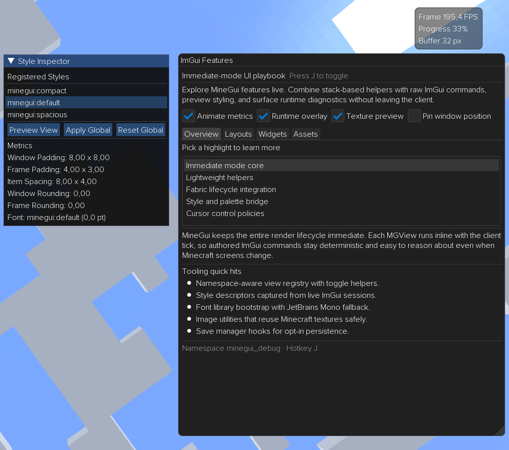

# MineGui
MineGui is a Fabric client library that embeds Dear ImGui into Minecraft 1.21.4, giving mod developers an immediate-mode toolset for in-game overlays, inspectors, and interactive editors without leaving the client.



---

## Philosophy & Goals
- Immediate-first runtime that stays thin so you can script raw ImGui every frame.
- Utility-driven helpers for cursor policies, constraint math, textures, and fonts without dictating component hierarchies.
- Stable, lightweight lifecycle that prioritizes predictable hooks and minimal overhead in production builds.

---

## Developer Docs
You can find the developer documentation [HERE](docs/introduction.md).

---

## Supported Features
MineGui bundles the full imgui-java runtime and layers tooling around it so you can stay inside Dear ImGui while building Fabric mods:
- **Full Dear ImGui API** — Views (`MGView`) implement `renderView()` and call native widgets every frame while MineGui drives the render loop.
- **View lifecycle & persistence** — `ViewSaveManager` tracks visibility, persists window state, and lets you plug in custom adapters per namespace.
- **Themes, fonts & styles** — `StyleManager`, `MGStyleDescriptor`, and `MGFontLibrary` manage transient style deltas, named themes, and registered font atlases.
- **Layouts & sizing helpers** — `UI` exposes scoped helpers over `VStack`/`HStack`, constraint math, and spacing utilities for common layout patterns.
- **Textures & drawing utilities** — `ImGuiImageUtils` streams Minecraft textures into ImGui draw lists, handles UV transforms, and keeps caches in sync with the client renderer.
- **Namespaces, config & commands** — `MineGuiInitializationOptions` wires global config, cursor policies, and persistence per namespace, while commands like `/minegui reload` refresh live styles during development.

---

## Supported Minecraft Versions
- Fabric Loader 1.21.4 with Yarn mappings `1.21.4+build.8`

---

## Installation & Initialization
Set `minegui_version=0.0.3-0.119.4+1.21.4+build.8` in your `gradle.properties`, then follow the steps below. Check [GitHub Packages](https://github.com/trethore/MineGui/packages) for the latest published versions.

1) Add the GitHub Packages repository  
   In your root `build.gradle` (or `settings.gradle` if you centralize repositories), include:
```groovy
repositories {
    maven {
        url = uri("https://maven.pkg.github.com/trethore/MineGui")
        credentials {
            username = findProperty("gpr.user") ?: System.getenv("GITHUB_ACTOR")
            password = findProperty("gpr.key") ?: System.getenv("GITHUB_TOKEN")
        }
    }
}
```
Recommended: store credentials in `~/.gradle/gradle.properties`.
```
gpr.user=YOUR_GITHUB_USERNAME
gpr.key=YOUR_PERSONAL_ACCESS_TOKEN
```
Generate a personal access token with `read:packages` scope.

2) Add the dependency  
   Declare MineGui as a mod dependency alongside Fabric loader and Fabric API:
```groovy
dependencies {
    modImplementation include("tytoo.minegui:minegui:${project.minegui_version}")
    sourceDeps "tytoo.minegui:minegui:${project.minegui_version}:sources@jar"
}
```
Alternatively, add MineGui through Maven:
```xml
<dependency>
  <groupId>tytoo.minegui</groupId>
  <artifactId>minegui</artifactId>
  <version>0.0.3-0.119.4+1.21.4+build.8</version>
</dependency>
```

3) Initialize MineGui in your client entrypoint  
   MineGui does not auto-register a runtime initializer. Call `MineGuiCore.init(...)` before you register any views:
```java
import net.fabricmc.api.ClientModInitializer;
import tytoo.minegui.MineGuiCore;
import tytoo.minegui.MineGuiInitializationOptions;
import tytoo.minegui.runtime.MineGuiContext;

public final class MyModClient implements ClientModInitializer {
    private MineGuiContext mineGui;

    @Override
    public void onInitializeClient() {
        mineGui = MineGuiCore.init(MineGuiInitializationOptions.defaults("your_namespace"));
        // mineGui.layout() exposes the new layout DSL; mineGui.ui() returns the namespace UI manager.
    }
}
```

4) Run in development  
   Use the bundled Gradle tasks while building MineGui or integrating it into another mod:
```bash
./gradlew build            # assemble artifacts and run checks
./gradlew runDebugClient   # develop MineGui with debug overlays and commands enabled
# or, when testing MineGui as a dependency in another mod:
./gradlew runClient
```
In-game debug commands such as `/minegui reload` and `/minegui export style force` are available only in debug runs.

---


## Contributing
Contributions are welcome!

- Report bugs or request features in the [issue tracker](https://github.com/trethore/MineGui/issues).
- Submit improvements and fixes as [pull requests](https://github.com/trethore/MineGui/pulls).
- Before contributing, make sure you can build and test the project locally:

  ```bash
  ./gradlew build            # assemble and run checks
  ./gradlew runDebugClient   # develop MineGui with debug commands enabled
  # or, when testing MineGui as a dependency in another mod:
  ./gradlew runClient
  ```

Please follow best practices (clean code, descriptive commits, small PRs).

## License
MineGui is released under the [MIT License](LICENSE).
